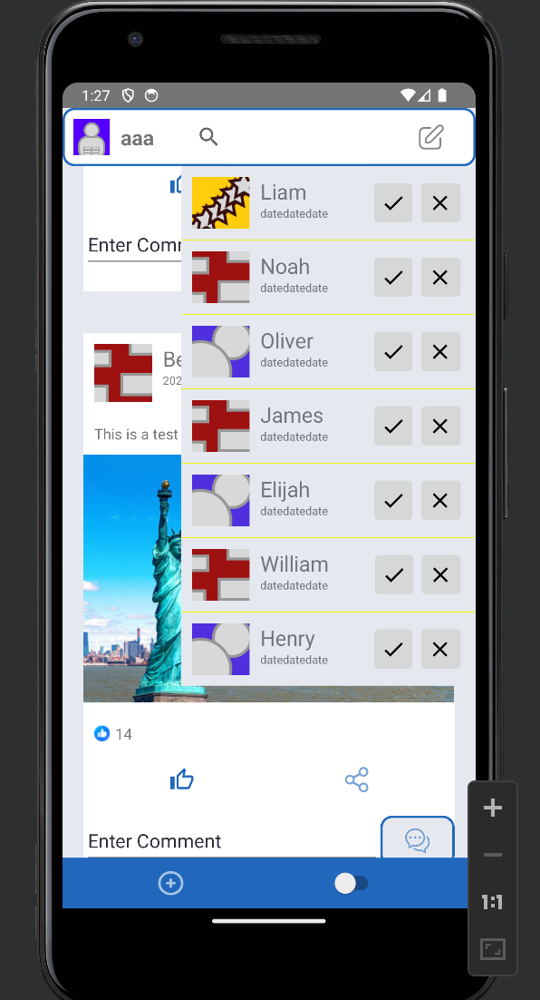
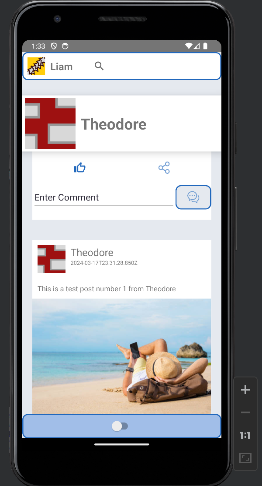
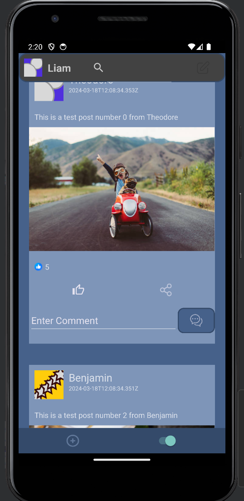

## Android

server: [link](https://github.com/MikeShlapakov/Manikel-server-side) <br>
web app: [link](https://github.com/MikeShlapakov/Manikel-web-app/tree/Part3) <br>

<br>
Implemented using the MVVM architecture, 
using retrofit2 to handle API requests to and from server.
<br><br><br>

the APIs being used reside in
```apis/WebServiceAPI```  &&  ```apis/```

the Bodies used in the POST/PATCH requests to the server reside in 
```entities/BodyRequests```

all Objects used reside in 
```entities```
<br><br>

#### features
- makes use of tokens, that are created with each user in order to verify server requests.
- local users, posts on screen get updated when reload occurs by scrolling up.
- shows sorted posts by date, 20 from friends and another 5 from strangers.
- has friends support, add/remove friends.
- you can see the posts of friends
- you can login to any user in the db.
- dark mode
- default user pfp if none given
- success and error logs on screen
- flabberghasting UI

<br>

### Images






